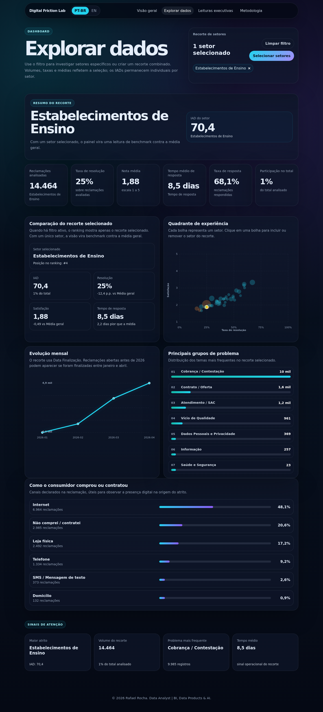

# Quanto custa uma experiência digital ruim?

Estudo autoral de BI e produto de dados, publicado por Rafael Rocha em maio de 2026. Transforma reclamações do Consumidor.gov.br em indicadores de resolução, satisfação, resposta e atrito, com dashboard interativo em português e inglês.

A pergunta do título orienta uma leitura de esforço e atrito. O dashboard **não calcula custo monetário** nem consulta uma API em tempo de execução: usa o JSON agregado versionado em `src/data/dashboardData.json`.



## O que você pode explorar

- KPIs gerais e por seleção de setores.
- Rankings de IAD, quadrante de resolução/satisfação, evolução mensal, grupos de problemas e canais declarados.
- Busca e multisseleção de setores, limpeza do filtro e navegação PT-BR/EN.
- Leituras executivas pré-escritas, contextualizadas pelos dados; não são um chatbot.
- Metodologia e conteúdos editoriais em `content/`.

## Executar o dashboard

Use **Node 20.19+ ou 22.12+** e **pnpm 10.4.1**, conforme o Vite instalado e `packageManager`. Ambiente de referência no Linux: Node 22.23.1, pnpm 10.4.1, React 19.2.6, TypeScript 5.9.3 e Vite 7.3.3. As versões JavaScript são resolvidas pelo lockfile existente.

Na raiz do checkout, em Bash:

```bash
pnpm install --frozen-lockfile
pnpm dev --host 127.0.0.1
```

Abra **http://localhost:3000/experiencia-digital-ruim/**. Não precisa baixar CSVs, configurar chaves ou executar Python para explorar os dados disponíveis. Encerre com `Ctrl+C`.

Para conferir tipos e gerar os arquivos estáticos:

```bash
pnpm typecheck
pnpm build
pnpm preview --host 127.0.0.1
```

O build fica em `dist/`. O preview usa a mesma subpasta configurada em `vite.config.ts`. Há um workflow de GitHub Pages para `RochaRafa`; executar localmente não publica o projeto.

## Fonte e cobertura histórica

Fonte: [dados abertos do Consumidor.gov.br](https://dados.mj.gov.br/dataset/reclamacoes-do-consumidor-gov-br). O recorte considera **Data Finalização de janeiro a abril de 2026**; a abertura pode ter ocorrido antes.

| Arquivo de origem registrado | Linhas |
|---|---:|
| `basecompleta2026-01.csv` | 321.111 |
| `basecompleta2026-02.csv` | 341.707 |
| `basecompleta2026-03.csv` | 342.527 |
| `basecompleta2026-04.csv` | 375.043 |
| Base global | **1.380.388** |

O volume é contado por **linhas, sem deduplicação por identificador**. O ranking e o seletor incluem somente setores com **pelo menos 300 reclamações** no período: os **39 setores** atuais somam **1.379.792 registros**. Os 596 restantes entram nos KPIs globais, mas não nos setores selecionáveis. Selecionar todos os setores disponíveis não reproduz exatamente a cobertura global.

## Indicadores e IAD

- Resposta: registros com `Respondida = S` / total de registros.
- Resolução: `Resolvida` / avaliações `Resolvida` ou `Não Resolvida`.
- Satisfação: soma das notas / quantidade de notas numéricas disponíveis.
- Demora: soma dos tempos / quantidade de tempos numéricos disponíveis, independentemente do flag de resposta.

Taxas e médias de uma seleção usam as somas e contagens originais, não médias simples das taxas de cada setor. As parcelas sem denominador retornam ausentes na interface.

O **Índice de Atrito Digital (IAD)** é um índice exploratório autoral de **0–100**; valores maiores indicam maior atrito segundo essa combinação. A referência é o pipeline Python: 30% volume, 30% não resolução, 25% baixa satisfação e 15% demora. A demora é limitada ao p95 das médias dos setores elegíveis antes de normalizar; ausentes recebem valores globais e os fallbacks originais. A população de referência é fixa, sem renormalização ao filtrar.

Na interface:

- **Sem filtro:** “Maior IAD entre setores”, com o nome do setor. O **78,2** pertence a **Bancos, Financeiras e Administradoras de Cartão**.
- **Um setor:** IAD armazenado no JSON, igual no resumo, ranking e benchmark. **Estabelecimentos de Ensino: 70,4**.
- **Vários setores:** volumes, taxas e médias agregados; IADs individuais com seus nomes. Não há média de IADs nem índice combinado.

O pipeline calcula antes de arredondar. O JSON preserva o IAD com uma casa decimal, médias com duas, taxas/componentes e somas com quatro, e participação com seis. O filtro recompõe taxas e médias pelas somas e contagens, mas **não recalcula o IAD**. Veja a [metodologia completa](content/metodologia.md).

## Reconstrução opcional dos dados

O dashboard já inclui o JSON agregado e o [resumo de qualidade dos dados](docs/data_qa_summary.md). A reconstrução requer os quatro CSVs originais, que não estão no repositório, e pode gerar resultados diferentes se os arquivos de origem forem atualizados.

O pipeline requer Python e `requirements.txt`. Ambiente de referência: Python 3.10.12, pandas 2.3.3 e NumPy 2.2.6. Preparação em Bash:

```bash
python3 -m venv .venv
source .venv/bin/activate
python -m pip install -r requirements.txt
```

Baixe os quatro arquivos para uma pasta separada. O leitor usa `;`, `utf-8-sig` e as colunas da metodologia. Lê todos os `*.csv` da pasta; evite cópias duplicadas ou arquivos alheios ao recorte.

**O QA é escrito em `docs/data_qa_summary.md` relativo ao diretório corrente, mesmo com outro `--out-dir`.** Para manter os resultados da reconstrução separados da base versionada, execute o script a partir de um diretório temporário. Substitua `/caminho/para/os/csvs` pelo caminho absoluto da entrada:

```bash
project_root="$PWD"
pipeline_run="$(mktemp -d)"
cd "$pipeline_run"
python "$project_root/scripts/build_dataset.py" \
  --raw-dir /caminho/para/os/csvs \
  --out-dir "$pipeline_run/data"
cd "$project_root"
```

O JSON estará em `data/` e o QA em `docs/`, ambos dentro de `pipeline_run`. Os arquivos são gerados separadamente da base versionada do dashboard.

## Testes e build

Com as dependências correspondentes instaladas:

```bash
pnpm typecheck
pnpm build
python -m pip check
python -m unittest discover -s tests -v
```

Os testes Python executam as funções originais sobre fixtures pequenas e agregados existentes, sem importar o pipeline completo, ingerir CSVs ou sobrescrever o QA. A regressão de interface usa Playwright como ferramenta opcional, fora das dependências da aplicação:

```bash
python -m pip install playwright
python -m playwright install chromium
python tests/validate_dashboard.py --url http://localhost:3000/experiencia-digital-ruim/
```

Ela confere os 39 índices no resumo/ranking/benchmark, agregações, busca, limpeza, idiomas, navegação e layout desktop/mobile. Para usar Chrome instalado, passe `--browser-executable /caminho/para/google-chrome`. A opção `--capture docs/images/experiencia-digital-ruim.png` registra a demonstração real.

## Limitações

A fonte representa reclamações do canal público, não todos os consumidores. Volume não mede base de clientes ou qualidade absoluta; resolução não equivale a satisfação. O IAD ajuda a priorizar perguntas, não substitui diagnóstico operacional. Não há medida monetária ou integração em tempo de execução com a fonte. A reprodução integral depende dos CSVs de origem e não está estabelecida apenas pelo JSON agregado. O bundle gera um aviso de chunk maior que 500 kB; esse aviso não impede o build.

Autor: **Rafael Rocha — Data Analyst | BI, Data Products & AI**.
